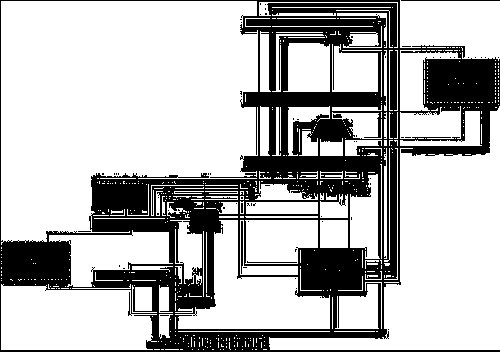

<b>实验 x 报告</b>
<div\>
      

学号：NaN 姓名：chuan-325 箱子号：NaN
<div\>
<!--
原实验报告参考格式说明：（摘自 word 文档）
    (1)	标题层次建议不超过四级，从第一级开始标号格式依次采用：一、二、三；（一）、（二）、（三）；1、2、3；（1）、（2）、（3）。
       (1.a)	一级标题用小三号字，中文为黑体，英文为Times New Roman，单倍行距，段前段后各0.5行。
       (1.b)	二级标题用四号字，中文为黑体，英文为Times New Roman，单倍行距，段前段后各0.25行。
       (1.c)	三级标题用小四号字，中文为黑体，英文为Times New Roman，单倍行距。
       (1.d)	四级标题用五号字，中文为黑体，英文为Times New Roman，单倍行距。
    (2)	正文用五号字，中文为宋体，英文为Times New Roman，1.5倍行距。
    (3)	所有图统一顺序标号，图标题紧挨在图的下方，居中，用小五号字，中文为宋体，英文为Times New Roman，单倍行距，段后0.5行。
    (4)	所有表统一顺序标号，图标题放在表的上方，居中，用小五号字，中文为宋体，英文为Times New Roman，单倍行距，段前0.5行。
-->

## 一、实验任务

<!-- 根据你对实验任务说明的理解，说清楚了这个实验要干什么以及如何检验。-->

1.

## 二、实验设计

### （一）总体设计思路

<!--阐明总体设计思路，即从系统顶层角度出发，概要性地描述整个系统的工作机制，所需要进行哪些实验设计、完成哪些功能。在进行本章节描述时，推荐以结构设计图的形式阐述硬件部分，以流程图的形式阐述软件部分。
	需要给出参考设计的结构设计图！
	如果实验设计比较复杂，那么最好进行模块划分，挑选重要模块进行描述。-->

CPU 结构设计框图如下：

<!--请将图片路径等更换为本地的相应路径-->

    <figure style="text-align:center">
	
         
         
        <figcaption style="font-size :9pt">
            图 1&nbsp;&nbsp;
        </figcaption>
	</figure>

### （二）重要模块 1 设计：xxx 模块

<!--进行重要设计的具体描述。-->

#### 1. 工作原理

<!--为什么要这么设计，其基本工作机制是否合理-->

#### 2. 接口定义

<!--每部分的接口是什么。如果写报告的时间充裕，可以以表格形式列出；如果时间仓促，该节可以一笔带过。-->

| 名称 | 方向 | 位宽 | 功能描述 |
| ---- | ---- | ---- | -------- |
|      | IN   |      |          |
|      | OUT  |      |          |
|      |      |      |          |
|      |      |      |          |

#### 3. 功能描述

<!--内部具体是怎么设计的，描述要简洁明了，直中要害。-->

## 三、实验过程

### （一）实验流水账

<!--记录哪一天，几点到几点，做了什么事，结果如何。事情不要展开来写。-->

### （二）错误记录

<!--以下错误记录 也就是记录 子任务二 的完成过程。-->

#### 1. 错误 1 : xxxx

##### (1) 错误现象

<!--描述这个错误产生时的现象-->

##### (2) 分析定位过程

<!--说清楚你碰到这个问题是如何分析定位出错原因的。可能你分析定位过程中经历了多轮尝试，把它们都记录下来。-->

##### (3) 错误原因

<!--给出一个出错原因的正式说明。-->

##### (4) 修正效果

<!--说明你修正这个错误的方法，并说明它是否有效。-->

##### (5) 归纳总结

<!--说说你觉得这个错误是哪种类型的，今后如何提前规避。-->

## 四、实验总结

<!--可选：供同学们吐槽之用-->